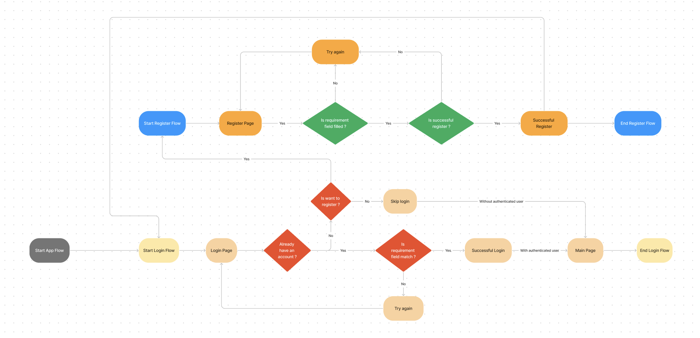

# NawatechGallery

## User Story

- As a user, I can register. ✅
- As a user, I can login. ✅
- As a user, I can logout. ✅
- As a user, I can edit my profile including my profile picture. (Only profile picture ✅)
- As a user, I can see motorcycle catalogue with motorcycle thumbnail. ✅
- As a user, I can see the details of motorcycle. ✅
- As a user, I can see motorcycle gallery. ❌
- As a user, I can order a motorcycle product. ✅
- As a user, I can see my orders. ✅
- As a user, I can cancel my orders ❌
- As a user, I can see my dashboard order summary(With chart) ❌

---

## How to run the app ?

Because the project is using `Firebase`, the Bundle ID and the configuration files need to match so can connect with the Firebase.

### Use existing `Firebase` project configuration
1. Clone this project
2. Make sure the bundle identifier is `com.reynaldiwijaya.NawatechGallery` and also in `GoogleService-Info.plist` file.

### Use your `Firebase` project configuration
1. Clone this project.
2. Change the bundle identifier that match with your Firebase project.
3. Change the `GoogleService-Info.plist` with yours.
4. Configure the `FirebaseStore` for the `users` and `catalogue`.

---

## Firebase Store Configuration

### Users

```
Path user:  users/{userID}
Path orders: user/orders/{orderID}

2xx RESPONSE

[
  {
	"id": "(Formatted-UUID)",
	"fullname": "(Any string value))",
	"username": "(Any string value)",
	"password": "(Any string value)",
    	"created_at": (Date Time interval -> Number)
	"image_url": "URL string",
	"orders": [{
        	"catalogue_item_id": "(Formatted-UUID)",
        	"order_id": "(Formatted-UUID)",  
        	"quantity": number,
      	}]
  }
]
```

---

### Catalogue

```
Path catalogue/motorcycle/items/{itemID}

2xx RESPONSE

[
  {
	"item_id": "(Formatted-UUID)",
	"name": "(Any string value))",
	"detail": "(Any string value)",
	"image_url": "URL string",
    	"price": Number,
  }
]
```

---

## Issues

### Unit Test

Somehome when run the unit test will failed/crash because `Firebase` configuration. To solve this, can delete this code below in the `AppDelegate`. And after test should put it back to running the app.

```
FirebaseApp.configure()
```

### Not Supported Dark Mode

---

## Authentication Flowchart


